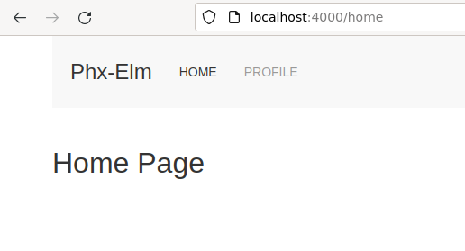
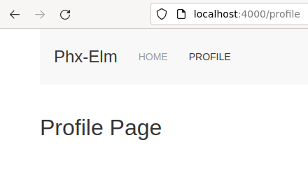

# phx-elm-uikit

## Project Intention

This is a proof-of-concept project with the following technologies:

1. Elm
2. UIkit
3. Phoenix Web Server

## The Elm Model

Despite it is a Single Page Elm app, different pages are simulated with the contents in the Elm `Model`.
The Model holds the `Page` and the data that is used for the presentation of the page. E.g. Which menu item is active and what page contents should be displayed.


```
type alias Model =
    { key : Nav.Key
    , page : Page
    }


type Page
    = HomePage HomeData
    | ProfilePage ProfileData
    | ErrorPage String
```

The Page Data is currently read from a JSON String, but can be easily ported to fetch it from a server.

## Use-Cases

It is a really simple simulation of switching pages

1. Home page
2. Profile page

Here is how it looks like...

User clicked 'Home' menu



User clicked 'Profile' menu



## Elm & Phoenix Setup

Ref: https://github.com/dwyl/phoenix-elm-starter

```
$ cd <proect-root>

$ npm install -D esbuild-plugin-elm
$ npm install -D elm

$ mkdir assets/elm

$ cd assets/elm

$ elm init

$ cat > src/Main.elm <<EOF
module Main exposing (..)
import Html exposing (text)

name = "John"

main =
  text ("Hello " ++ name ++ "!")
EOF

$ cat > src/index.js <<"EOF"
import { Elm } from './Main.elm';

const $root = document.createElement('div');
document.body.appendChild($root);

Elm.Main.init({
  node: $root
});
EOF

$ cat > build.js <<"EOF"
const esbuild = require('esbuild');
const ElmPlugin = require('esbuild-plugin-elm');

esbuild.build({
  entryPoints: ['src/index.js'],
  outfile: '../vendor/elm.js',
  bundle: true,
  watch: process.argv.includes('--watch'),
  plugins: [
    ElmPlugin({
      debug: true,
      clearOnWatch: true,
    }),
  ],
}).catch(_e => process.exit(1))
EOF

$ cd ..

$ cat >> js/app.js <<EOF
import elm from '../vendor/elm'
EOF

$ cd ..

$ tail config/dev.exs
  watchers: [
    ...
    node: ["./build.js", "--watch", cd: Path.expand("../assets/elm", __DIR__)]
  ]
```

Start the server with `mix phx.server`

You should see "Hello John!" ath the bottom of thhe page

